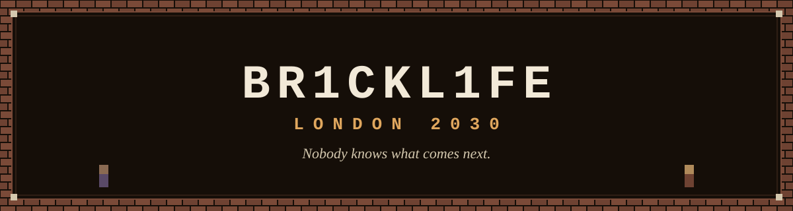
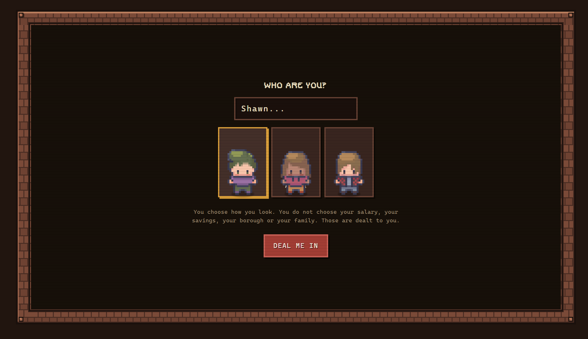
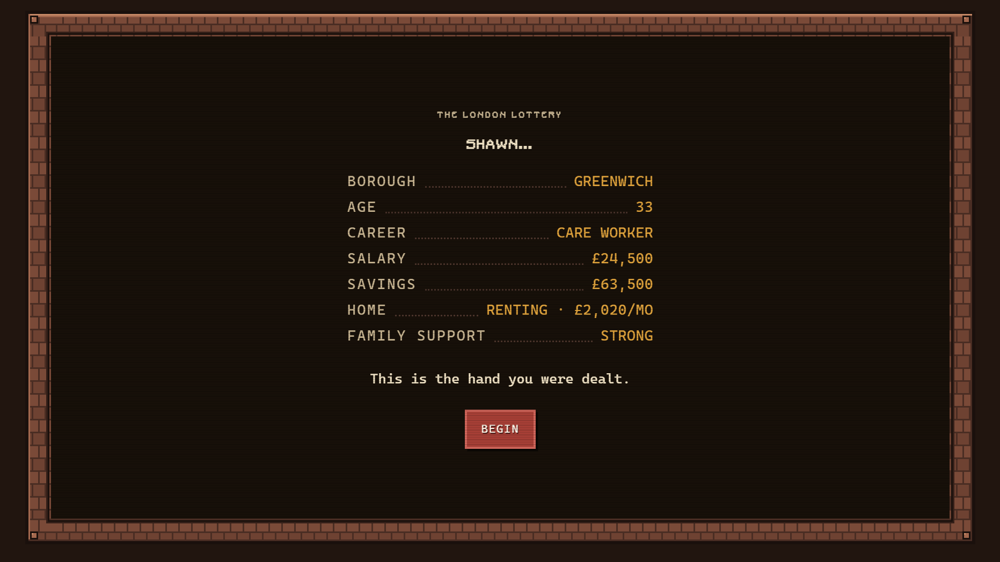
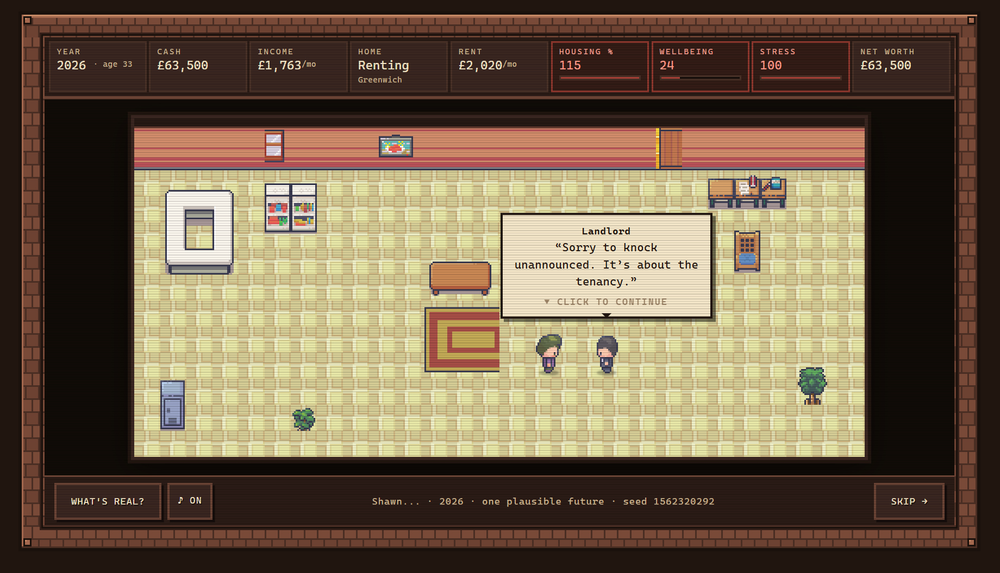
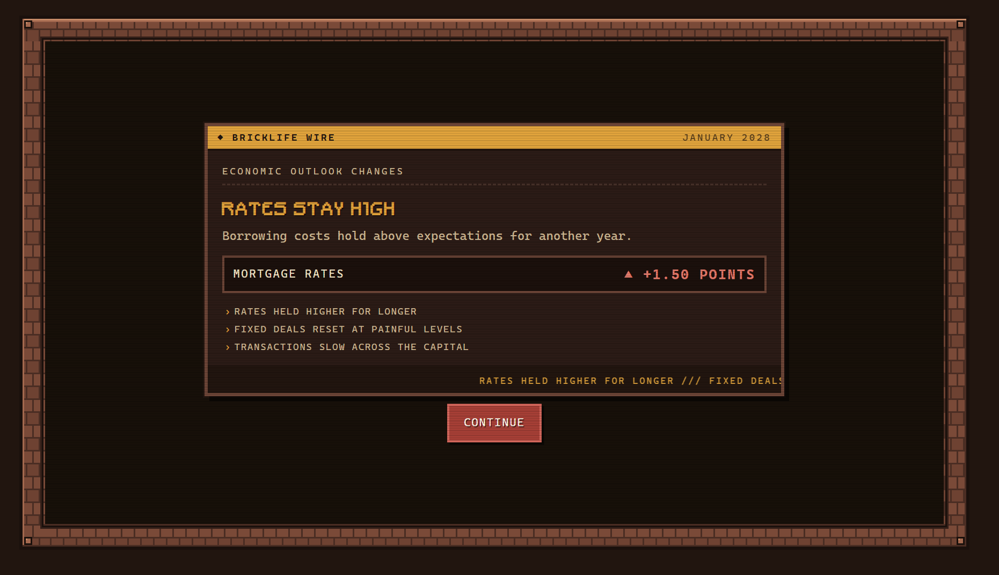
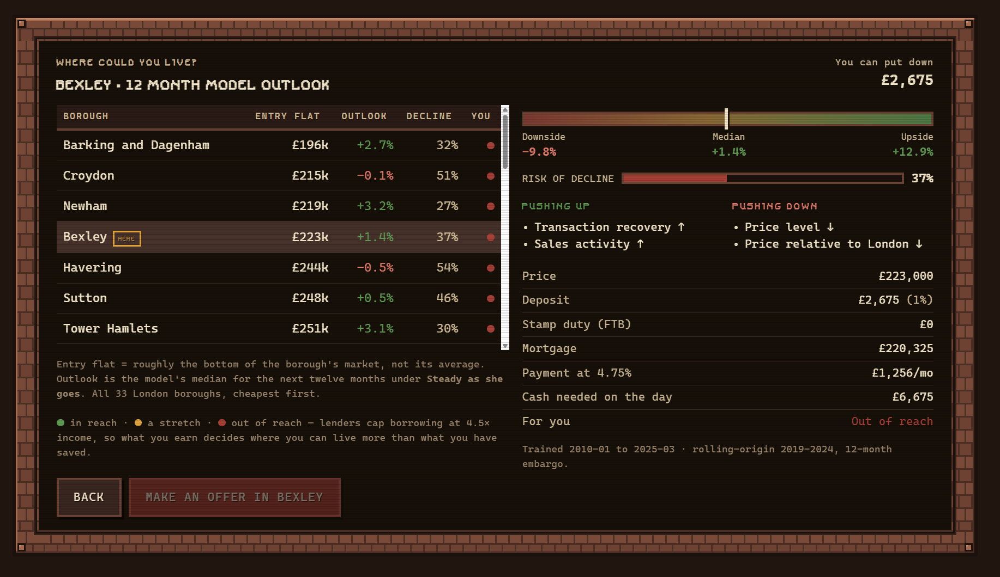
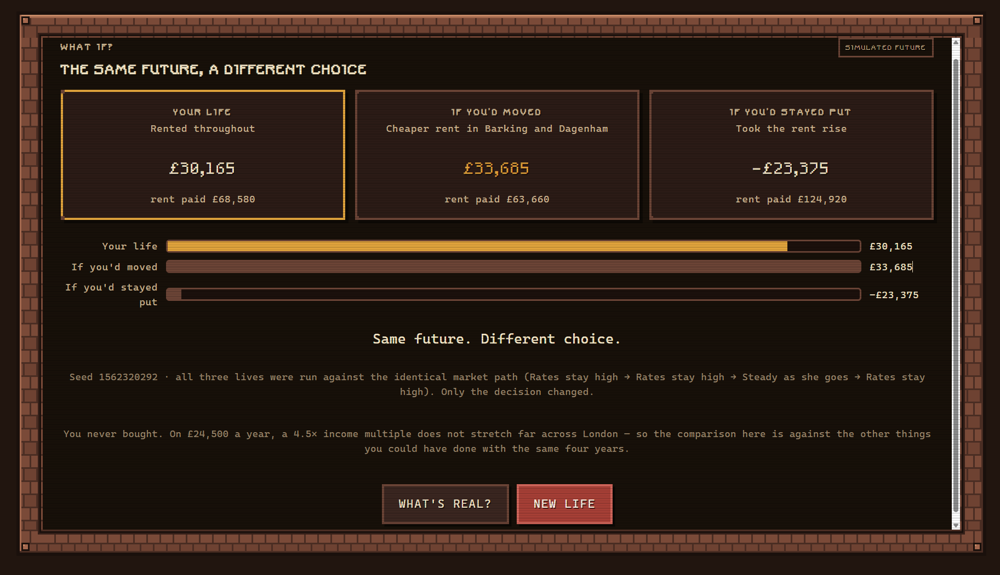
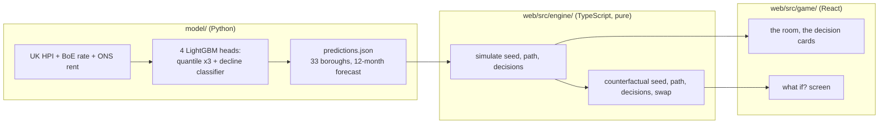

<div align="center">
  

  <br>

  `WINNER: GENERAL TRACK` &nbsp;·&nbsp; `WINNER: PEOPLE'S CHOICE`
  <br>
  <sub>House London Data Hackathon, hosted by Newspeak House, 29 August 2026</sub>
</div>

---

You're handed a life: a salary, some savings, a borough, sometimes a family
behind you, sometimes just yourself.

Then you get five years to decide whether to rent, buy, move, or wait, while a
real trained model tells you what London's housing market might do next.
Nobody, including the model, actually knows. At the end you see the same
future replayed with one decision changed, so you find out whether the choice
you made was the one that mattered.

Most housing-affordability tools give you a mortgage calculator. This one
hands you somebody else's constraints and lets the arithmetic surprise you the
way it surprises them.

## The London Lottery

*"You choose how you look. You do not choose your salary, your savings, your
borough or your family. Those are dealt to you."*

You pick how you look. Everything else is dealt:

<p align="center">
  
  
</p>

The room, mid-event. A landlord has let himself in about the tenancy:



> *"Sorry to knock unannounced. It's about the tenancy."*
> (the landlord)

A scenario card lands between years, narrating whatever the market just did:



If a flat comes up, you can check every borough against your own numbers
before deciding. The figures come straight from the model:



And at the end: the same seed, the same market, replayed against a different
decision.



> *Same future. Different choice.*

## What's actually happening under the floorboards

Three independent pieces, wired together at the end:



The model is a batch job: it runs once, in Python, and leaves
`predictions.json` behind as a checked-in file. Rerunning it in `model/`
updates that file; the game never talks to it directly. The whole web app is
static, built once and shipped as files, so there's nothing running in the
background that could fall over during a demo.

`simulate(seed, path, decisions)` is the only function the game calls to
advance a life, and it's a pure function: the same three arguments always
produce the same output. Every value it touches comes from those three
arguments alone. `web/src/engine/` never calls `Math.random` or `Date.now`,
and a test in that same folder scans the source to enforce it.

That rule is the entire reason the counterfactual works. "What if you'd
waited" has to replay the *identical* market, or the comparison means
nothing.

A few of the choices worth knowing about:

- **The rate scenario reaches the player's own mortgage**, not just the
  model's forecast. A 1.5-point shock adds roughly £150 to £250 to a typical
  first-time-buyer's monthly payment, worked out the same way a real lender
  would.
- **Affordability is checked in exactly one place.** `canAfford()` decides
  both whether the buy card offers a purchase and how the borough comparison
  table colours each borough, so the two screens always agree.
- **The model's own scorecard is on screen**, strengths and weaknesses side
  by side, on the in-game "about the data" panel, each number next to the
  baseline it's measured against.

## Deal yourself in

```bash
cd web
npm install
npm run dev        # http://localhost:5173
```

Or with Docker, from the repo root:

```bash
docker compose up --build
```

`predictions.json` already sits in the repo, so nothing needs regenerating to
play, and the web app has nothing to configure: see `web/.env.example` for
the full list of environment variables it reads (empty, on purpose).

To rerun the model pipeline itself (Python 3.11+, with `pandas`, `numpy`,
`scikit-learn`, `lightgbm`, `matplotlib`, `pyarrow`, and `openpyxl`
installed):

```bash
cd model
python 01_build_panel.py
python 02_baselines.py
python 05_rents.py
python 03_train_export.py    # -> web/src/data/predictions.json
python 04_backtest_chart.py  # -> web/public/backtest.png
```

Data provenance, the feature list, and the full backtest table live in
[`docs/model.md`](docs/model.md).

### Checks

```bash
cd web
npm run typecheck
npm run lint
npm run build
npm test          # 18 engine tests, pure, no fixtures, about a second
npm run smoke      # 400 simulated lives end to end, offline
```

All five run in CI on every push, pinned to Node 24, the same runtime the
engine's own tests run under directly. `node src/engine/sim.test.ts` just
works, because Node 24 strips TypeScript types on its own.

## What's still owed

**Event copy is a placeholder.**
The fourth lane planned for this build, event copy and flavour text, went
unstaffed. What ships in `web/src/content/copy.ts` is stopgap wording a
teammate wrote in the first twenty minutes so the engine had something to
attach to each event. It held up fine for a hackathon demo, but it's fifteen
minutes of writing standing in for a considered voice. A day of real
copywriting fixes it entirely inside that one file, engine and game code
untouched.

**One rent figure is estimated; the other 32 are real.**
City of London's rent is imputed at the median gross yield across the rest
of the boroughs, since ONS doesn't publish a Private Rents figure for it.
Every other borough's rent comes straight from the data. The same honesty
applies to the model: its directional accuracy and decline classifier trail
their baselines, as covered above, so treat the interval as the trustworthy
half.

**A life lasts exactly as long as the tab stays open.**
There's no save state. Close the tab and the run is gone. Adding persistence
means a backend and some auth, a different weekend's project rather than an
afternoon's tweak.

**The art pipeline is a manual step.**
`tools/build_border.py`, `tools/build_room.py`, and `tools/gridview.py` built
the room art and border tile once, by hand, against the raw LimeZu
tilesheets. They're documented but not wired into CI, so regenerating any of
the pixel art means running them again yourself.

## Who's actually in this house

Three of us, not the four the original plan called for.

**Hemakesh Bavuluru** built the entire forecasting model: the panel-building
and feature pipeline, the four LightGBM heads, the rolling-origin backtest
and its embargo, the conformalised interval, the rate-elasticity scenario
method, and the export step. The honest go/no-go call in `docs/model.md`,
what the model is worth trusting for and what it isn't, is his.

**Shawn D'Souza** (me) built the simulation engine: the seeded, pure
`simulate`/`counterfactual` core, the finance math (UK stamp-duty bands,
amortisation, PAYE/NI approximation, lender affordability rules), the six
event families and their gating logic, and the adapter that reads
`predictions.json` defensively enough to keep the game running even against a
malformed export.

**Bartosz Bielecki** built the entire playable game on top of both: every
scene, the room and its pixel-art staging, the decision cards, the sound
design, the borough comparison and counterfactual screens, and the wiring
layer tying the model's output and the engine's simulation into what you
actually see and click.

## Repository layout

```
model/          the forecasting pipeline (Python), a batch job, not a service
data/raw/       source data: UK HPI, BoE Bank Rate, ONS rents
web/            the game (React + TypeScript + Vite)
  src/engine/   simulate(), counterfactual(), finance, the event system, pure
  src/game/     everything rendered: scenes, components, sound
  src/content/  event copy, career/borough fallback data
  src/data/     predictions.json, the model's checked-in output
docs/           the model writeup and the banner and screenshots used above
```

---

<div align="center">
<sub>This is one plausible future, not a forecast of destiny.</sub>
</div>
