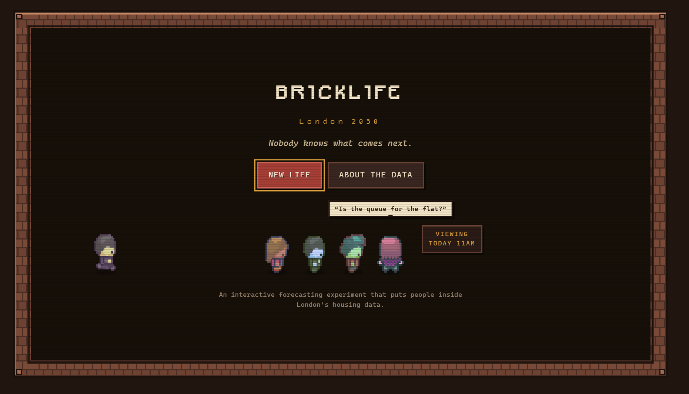
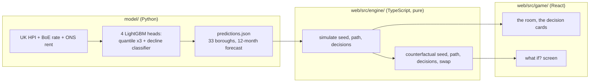

<div align="center">

# BR1CKL1FE

### London 2030

*Nobody knows what comes next.*

An interactive forecasting experiment that puts people inside London's housing data.

`WINNER — GENERAL TRACK` &nbsp;·&nbsp; `WINNER — PEOPLE'S CHOICE`
<br><sub>House London Data Hackathon, hosted by Newspeak House — 29 August 2026</sub>

</div>

---

You're handed a life: a salary, some savings, a borough, sometimes a family behind
you and sometimes not. Then you get five years to decide whether to rent, buy,
move, or wait, while a real trained model tells you what London's housing market
might do next — and nobody, including the model, actually knows. At the end you
see the same future replayed with one decision changed, so you can find out
whether the choice you made was the one that mattered.

Most housing-affordability tools give you a mortgage calculator. This gives you
someone else's constraints and lets the arithmetic surprise you the way it
surprises them.

## The London Lottery

*"You choose how you look. You do not choose your salary, your savings, your
borough or your family. Those are dealt to you."*

Every life starts the same way — pick how you look, not what you're dealt, then
find out the hand you actually got:

<p align="center">
  
  
</p>

Then the room, mid-event. A landlord has let himself in about the tenancy:


> *"Sorry to knock unannounced. It's about the tenancy."* — the landlord

A scenario card lands between years, narrating whatever the market just did:


If a flat comes up, check every borough against your own numbers before deciding
— this is the model talking, not a guess:


And at the end: the same seed, the same market, replayed against a different
decision.


> *Same future. Different choice.*

<p align="center"></p>

## What's actually happening under the floorboards

Three independent pieces, wired together at the end:



The model is a batch job, not a service — `predictions.json` is a checked-in
build artifact, regenerated by re-running the pipeline in `model/`, not fetched
live. The web app never calls anything over the network; there is nothing to
authenticate and nothing that can go down.

`simulate(seed, path, decisions)` is the only function the game calls to
advance a life, and it is a pure function: same three arguments in, identical
output out, forever. No `Math.random`, no `Date.now`, nothing read from outside
its own arguments anywhere in `web/src/engine/` — a test in that directory
scans the source and fails the build if it finds either. That rule is the
entire reason the counterfactual works: "what if you'd waited" has to replay
the *identical* market, or the comparison is meaningless.

## Four decisions a judge actually asked about

**Why `simulate` had to be pure, not just tidy.** The counterfactual screen
takes a finished life and swaps one decision, then reruns it against the same
seed and the same scenario path. If any part of the simulation depended on wall
clock time or an unseeded random call, "same future, different choice" would
quietly become "different future, different choice," and the screen would show
the player something that isn't true. This is checked twice: a unit test
asserts `simulate` returns byte-identical JSON on repeat calls, and a separate
script (`web/scripts/check-counterfactual.ts`) runs 400 simulated lives and
confirms every alternate ending actually differs from the one played — a
regression here would be silent otherwise, since a broken counterfactual still
renders three numbers, they'd just be lying.

**Why the rate scenario is applied twice.** The original plan for "rates stay
high" was to let the model's own forecast carry it: a higher-rate scenario
would nudge the model's price prediction down and that would be the whole
effect. It was too quiet. Momentum and price-relative-to-London features
dominate the LightGBM heads, so a rate shock moves the median forecast by a
fraction of a point — nowhere near dramatic enough to be the demo's loudest
beat. The fix was to stop routing it entirely through the model: the scenario
still shifts the model's forecast a little, but it also shifts the player's
own mortgage rate directly, in real amortisation arithmetic
(`Mortgage.basePct + rate_delta_pp`, recomputed every year). A 1.5-point shock
on a typical first-time-buyer mortgage moves the monthly payment by roughly
£150–250 — a number people in the room recognised immediately, because it's
just their own mortgage statement.

**Why affordability lives in the engine, not the screen that shows it.** The
buy-opportunity event only ever offers a "buy here" choice if `canAfford()` —
lender income multiple, minimum deposit, cash needed on completion — actually
returns true, and the borough comparison table calls the exact same function
to grey out boroughs as "in reach," "a stretch," or "out of reach." Two
affordability checks that could drift apart is how you end up with a button
that looks clickable and silently does nothing, or a comparison table that
disagrees with the card underneath it.

**Why the model's own weaknesses are on screen, not just its wins.** The
backtest (rolling-origin, 2019–2024, a 12-month embargo at every split so the
target window never leaks into training) shows the point forecast beating
persistence and a London-wide-trend baseline on error — a real result. It also
shows direction accuracy *below* a majority-class baseline, and a decline
classifier that doesn't beat its own base rate. The original plan was to lead
the pitch with the model's cleverness; the backtest made that dishonest, so the
"about the data" screen in-game states both, plainly, with the actual numbers
next to the baseline they're being compared against. The interval is
calibrated and worth trusting; the direction call is not, and the game says so
before a judge could find it themselves.

## Deal yourself in

```bash
cd web
npm install
npm run dev        # http://localhost:5173
```

Or with Docker, from the repo root:

```bash
docker compose up --build
```

The web app takes no environment variables and calls no external service —
see `web/.env.example`. `predictions.json` is already in the repo, so nothing
needs regenerating to play.

To rerun the model pipeline itself (Python 3.11+, needs `pandas`, `numpy`,
`scikit-learn`, `lightgbm`, `matplotlib`, `pyarrow`, `openpyxl`):

```bash
cd model
python 01_build_panel.py
python 02_baselines.py
python 05_rents.py
python 03_train_export.py    # -> web/src/data/predictions.json
python 04_backtest_chart.py  # -> web/public/backtest.png
```

Full data provenance, feature list, and the backtest table are in
[`docs/model.md`](docs/model.md).

### Checks

```bash
cd web
npm run typecheck
npm run lint
npm run build
npm test          # 18 engine tests — pure, no fixtures, ~1 second
npm run smoke      # 400 simulated lives end to end, offline, no install beyond above
```

All five run in CI on every push, pinned to Node 24 — the same runtime the
engine's tests execute under directly, with no separate test-runner
dependency (`node src/engine/sim.test.ts` just works, because Node 24 strips
TypeScript types itself).

## What's still owed

The fourth lane planned for this build — event copy and flavour text — was
never staffed. What ships in `web/src/content/copy.ts` is stopgap text a
teammate wrote in the first twenty minutes so the engine had something to
attach to each event; it happened to be good enough to demo on on the day, but
it's fifteen minutes of writing, not a considered voice. A day of real
copywriting would fix this and it wouldn't touch a single line of engine or
game code — that boundary was deliberate.

City of London's rent figure is imputed (median gross yield across the other
32 boroughs) because ONS doesn't publish a Private Rents figure for it; every
other borough's rent is real. The model's directional accuracy and decline
classifier don't beat their baselines, as above — the interval is the part
worth trusting.

There's no persistence. A life exists for as long as the tab is open; closing
it loses the run. Adding save state would mean a backend and some auth, which
is a different weekend's worth of work, not an afternoon's.

The pixel art pipeline (`tools/build_border.py`, `tools/build_room.py`,
`tools/gridview.py`) is a one-off asset-authoring step, not something CI runs
— regenerating the room art or border tile means running those by hand against
the raw LimeZu tilesheets. Documented, not automated.

## Who's actually in this house

Three of us, not the four the original plan called for.

**Hemakesh Bavuluru** built the entire forecasting model: the panel-building
and feature pipeline, the four LightGBM heads, the rolling-origin backtest
with its embargo, the conformalised interval, the rate-elasticity scenario
method, and the export. The honest go/no-go call in `docs/model.md` — what the
model is and isn't good for — is his.

**Shawn D'Souza** (me) built the simulation engine: the seeded, pure
`simulate`/`counterfactual` core, the finance math (UK stamp-duty bands,
amortisation, PAYE/NI approximation, lender affordability rules), the six
event families and their gating logic, and the adapter that reads
`predictions.json` defensively enough to survive a malformed export without
the game crashing.

**Bartosz Bielecki** built the entire playable game on top of both: every
scene, the room and its pixel-art staging, the decision cards, the sound
design, the borough comparison and counterfactual screens, and the wiring
layer that ties the model's output and the engine's simulation into what you
actually see and click.

## Repository layout

```
model/          the forecasting pipeline (Python) — batch job, not a service
data/raw/       source data: UK HPI, BoE Bank Rate, ONS rents
web/            the game (React + TypeScript + Vite)
  src/engine/   simulate(), counterfactual(), finance, the event system — pure
  src/game/     everything rendered — scenes, components, sound
  src/content/  event copy, career/borough fallback data
  src/data/     predictions.json, the model's checked-in output
docs/           the model writeup, the original design contract, integration notes
```

---

<div align="center">
<sub>This is one plausible future, not a forecast of destiny.</sub>
</div>
